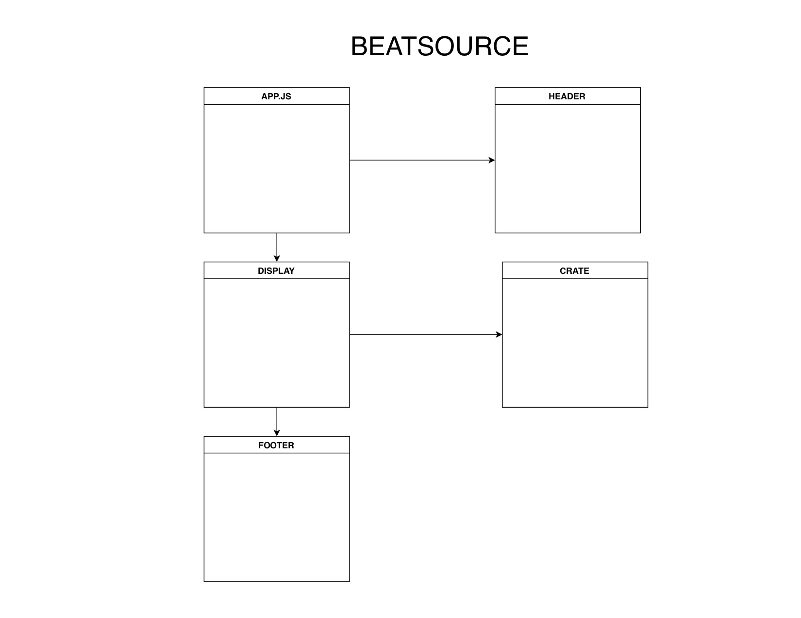
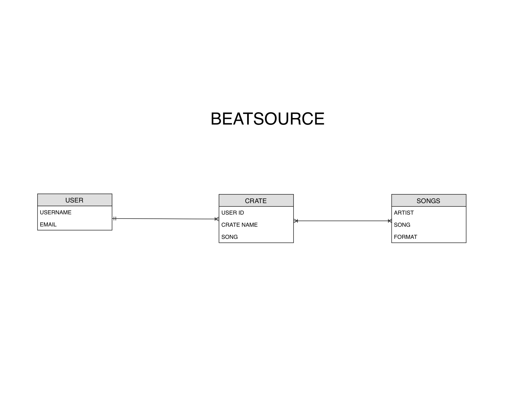
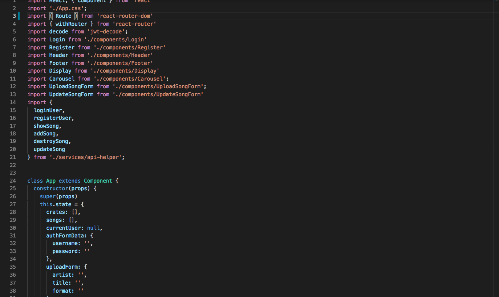

# Beatsource
Is a MP3 online store where artists can upload their own music and sell it.

# User Stories
- As an artist I use **Beatsource** to showcase and sell my music for user to download my craft.
- As an user i use **Beatsource** to download music of my favorites artist to listen or play on my dj gigs.

# Wireframes

# ERD

# Code Snippet

# Citation
I use npm package React Responsive Carousel on the Carousel.jsx for display the album cover on the display.jsx

# App
[beatsource](http://beatsource.surge.sh)
